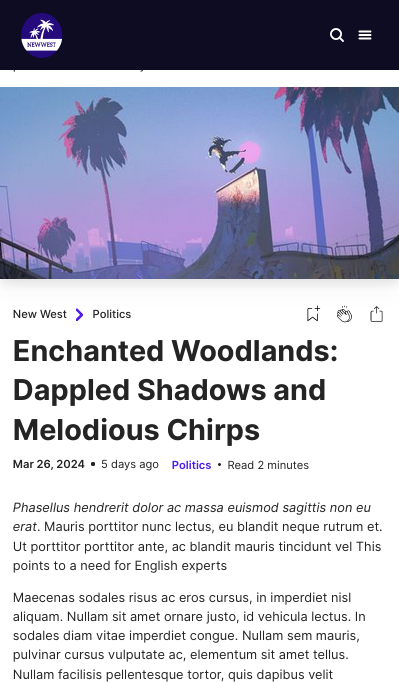

# New West

_Discover the World of Tomorrow._

## Table of contents

- [Overview](#overview)
  - [Product](#the-product)
  - [Screenshot](#screenshot)
  - [Links](#links)
- [My process](#my-process)
  - [Built with](#built-with)
  - [Technical instructions](#technical-instructions)
- [Author](#author)

## Overview

### The Product

.NewWest is an information platform that presents itself as an innovative news source, offering a fresh and modern perspective on current events. With a focus on innovation and exploring new frontiers, NewWest seeks to be a trusted destination for those seeking to discover and understand the ever-evolving world around us.

### Screenshot

### Links

- Figma Design URL: [NewWest Design](https://www.figma.com/file/B5AyrHZCGz4vAu8ypm98Qt/NewWest?type=design&node-id=0%3A1&mode=design&t=zEqApxUmfTimHMP8-1)
- Solution URL: [Github Repository : new-west-app](https://github.com/Lio-n/new-west-app)
- Live Site URL: [Vercel](/#)

## My process

### Built with

✅ [Vite.Js](https://vitejs.dev/) --> To streamline the development process by providing a fast, efficient, and developer-friendly build tooling solution. 
✅ [Graphql](https://graphql.org/) --> provides a more efficient, flexible, and powerful way to build and consume APIs. 
✅ [React.Js](https://react.dev/) --> To create robust user interfaces. 
✅ [Typescript](https://www.typescriptlang.org/) --> Due to its static typing. 
✅ [Vercel](https://vercel.com/docs) --> To deploy the project. 
✅ [Tailwindcss](https://tailwindcss.com/) --> To streamline the process of building and styling user interfaces. 
✅ [Dayjs](https://day.js.org/) --> A lightweight and modern JavaScript library for parsing, manipulating, and formatting dates and times. 
✅ [ESLint](https://eslint.org/) --> To enforce coding standards, detect potential errors, and ensure code consistency across a codebase. 
✅ [apollo/client](https://www.apollographql.com/docs/react/) --> Simplifies the process of working with GraphQL.

## Technical instructions

| Command         | Action performed                                                  |
| :-------------- | :---------------------------------------------------------------- |
| `npm install`   | Install all dependencies                                          |
| `npm run dev`   | Start a development server at `localhost:5173`                    |
| `npm run build` | Make the production build in `./dist/`                            |
| `npm run start` | To preview the build before deploying, server at `localhost:4173` |
| `npm run lint`  | Run ESLint to lint TypeScript and TypeScript files                |

## 👥 Authors

- 👨🏻‍💻 [Leonardo Fontan](https://github.com/Lio-n)
